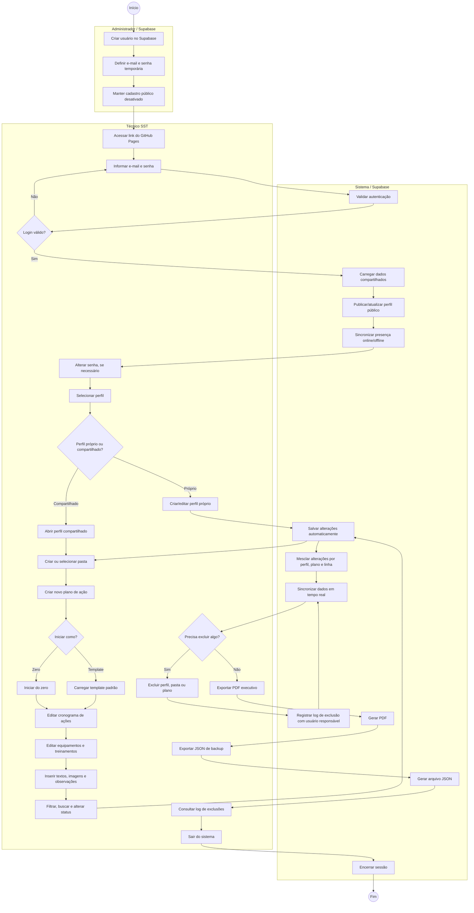

# BPMN - Processo do Sistema Planos de Ação SST

Este arquivo único documenta o processo operacional do sistema, desde a criação do usuário no Supabase até a gestão dos planos de ação, sincronização, exportação e consulta de logs.

O GitHub renderiza o diagrama Mermaid abaixo como uma imagem visual diretamente no arquivo.

## Regras Do Processo

- O administrador cria usuários diretamente no Supabase.
- O cadastro público fica desativado.
- O técnico acessa o sistema apenas com e-mail e senha autorizados.
- Todos os perfis são visíveis para a equipe.
- Qualquer técnico pode abrir perfis compartilhados para trabalho.
- Edição/exclusão de perfil exige confirmação protegida.
- Alteração de senha exige senha atual.
- Alterações são salvas automaticamente e sincronizadas em tempo real.
- Exclusões de perfil, pasta e plano são registradas em log.
- PDF executivo e backup JSON podem ser gerados pelo próprio sistema.

## Benefícios Do Processo

- Centraliza os cronogramas de ação de SST.
- Reduz uso de planilhas soltas.
- Padroniza a criação de planos por template.
- Melhora rastreabilidade de exclusões.
- Permite trabalho compartilhado entre técnicos.
- Mantém backup manual via JSON.
- Gera relatório executivo em PDF para documentação.

## Versão Curta Para Apresentação

O processo parte de usuários criados manualmente no Supabase, com cadastro público bloqueado. O técnico acessa o sistema, seleciona um perfil, organiza pastas, cria planos de ação e edita cronogramas de SST com salvamento automático. O sistema sincroniza os dados em tempo real, gera PDF/JSON e registra em log as exclusões de perfil, pasta e plano, informando qual usuário executou a ação.
